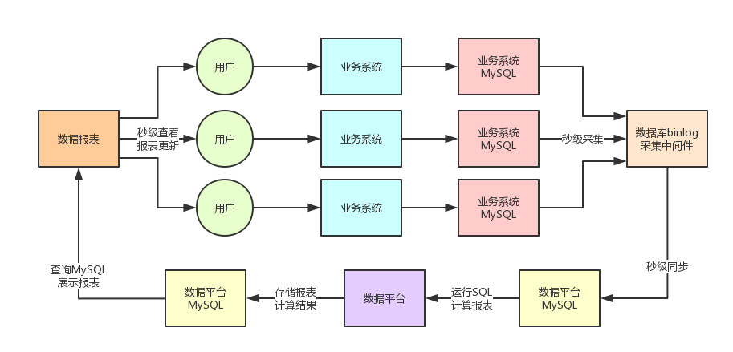
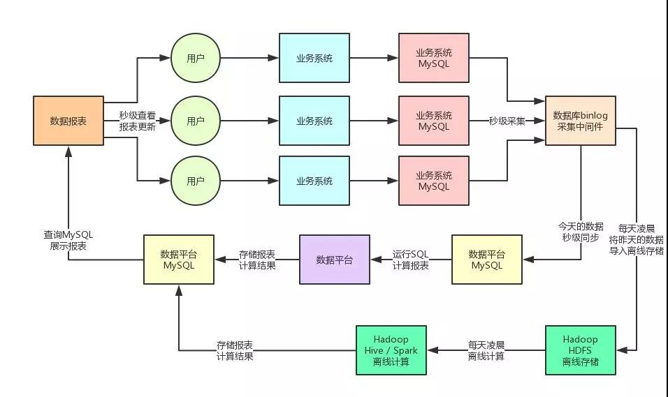
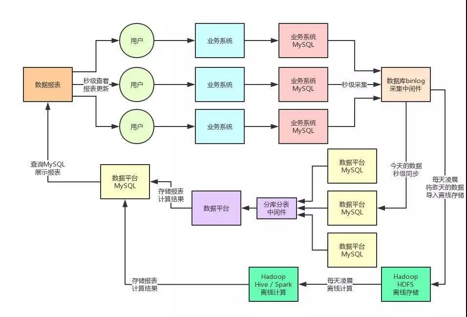
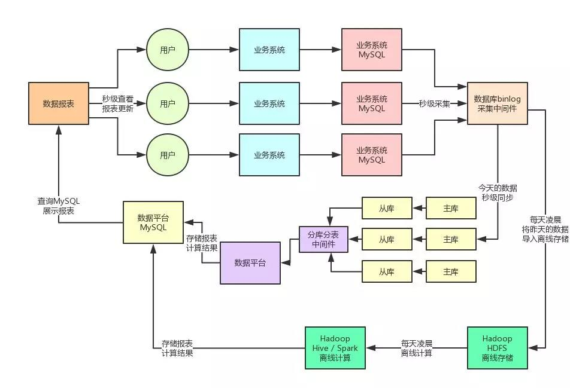
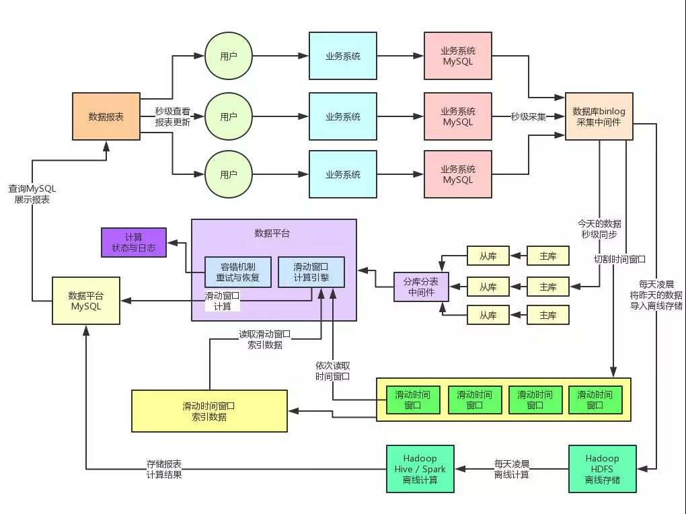
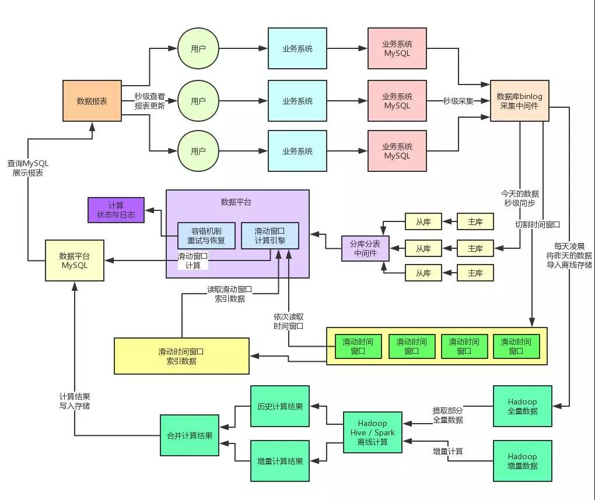
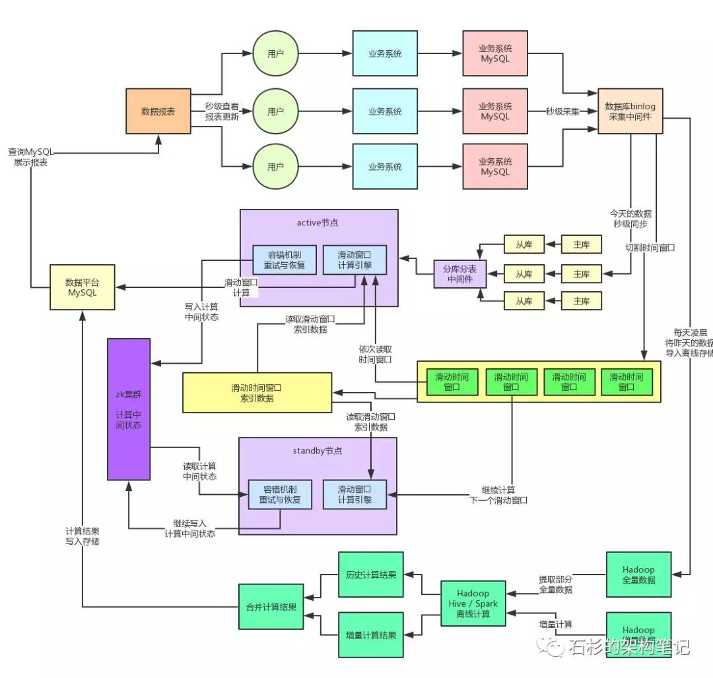
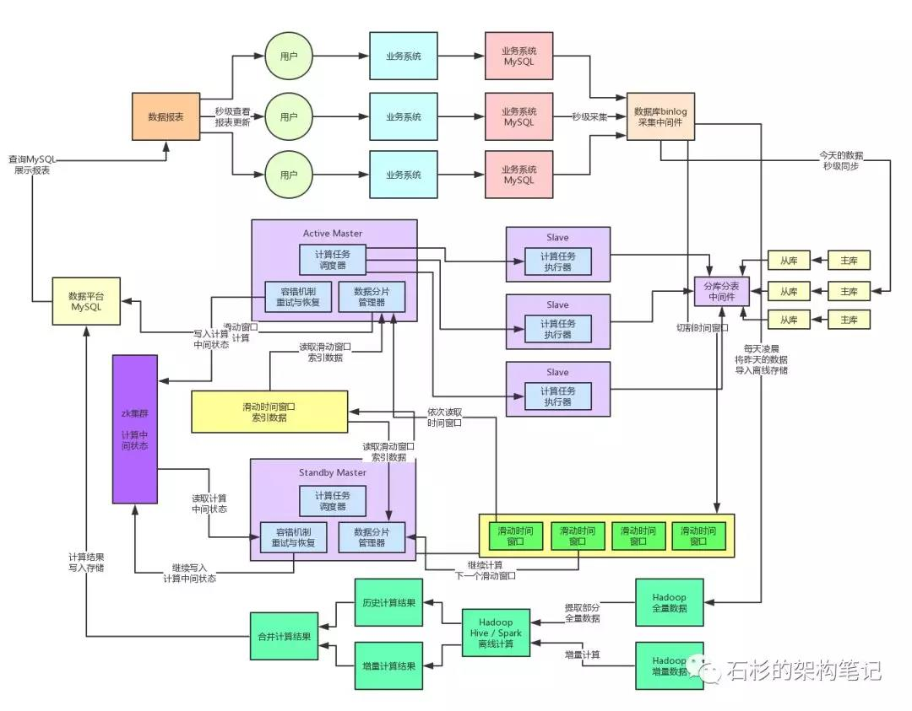
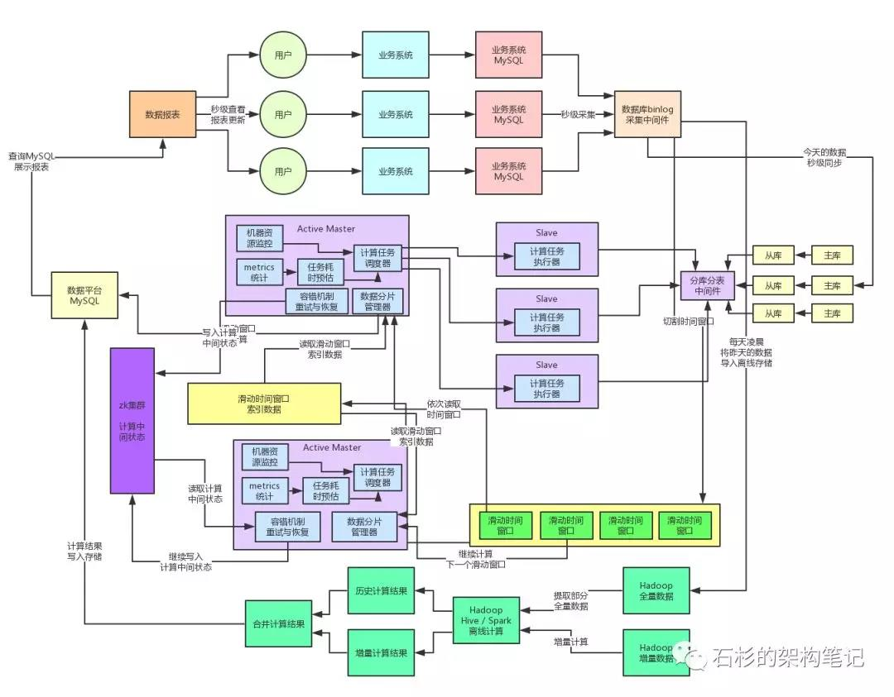
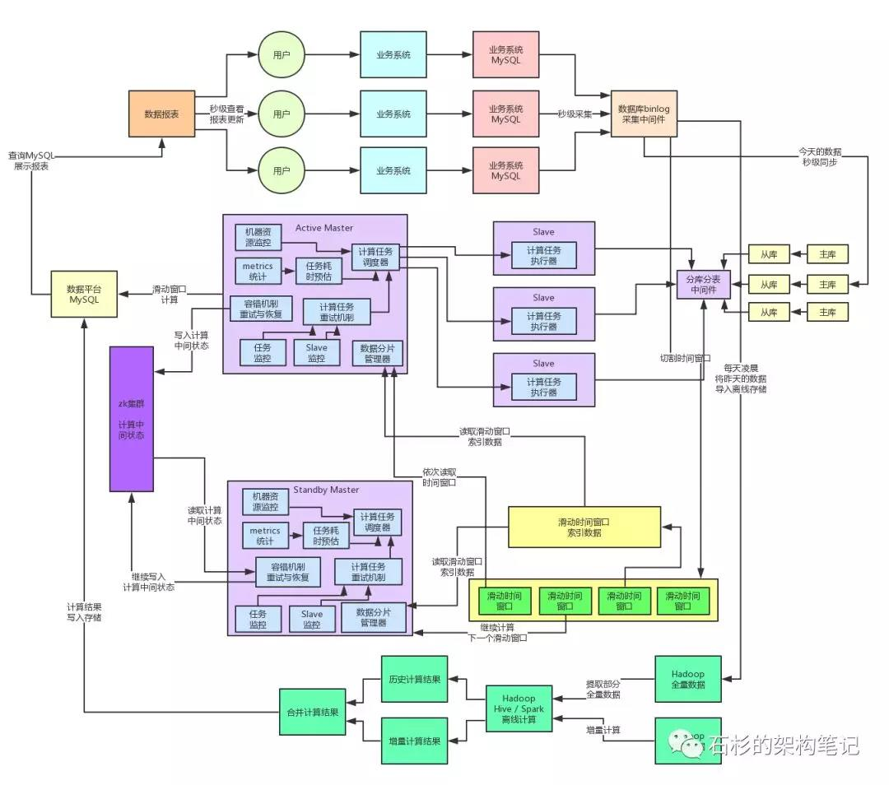

## 亿级流量关注点

### 1.存储与计算

### 2.高容错

### 3.每秒数10万查询高并发

### 4.全链路高可用99.99%


## 1.亿级流量架构存储与计算架构演变

1.第一版本



- 问题
- 1.业务发展，每天的数据达到亿级别，存储是个大问题
- 2.由于大表导致的查询缓慢，查询可能导致mysql宕机

- 3.如何解决

2.第二版本(离线与实时拆分)

- 1.思路:将昨天及昨天以前的数据在大数据中存储(分布式存储)，进行离线存储与离线计算
- 2.思路:将今天的数据进行实时计算



- 问题
- 1.业务发展，实时计算存储数据达到亿级别
- 2.由于大表导致的查询缓慢，查询可能导致mysql宕机
- 3.单台数据库服务器无法存储下当日的数据

- 3.如何解决


3.第三版本(实时数据每天达到亿级别)

- 1.思路:分库分表解决数据当日存储的瓶颈问题

- 问题

- 1.每一个数据库服务又读又写，导致数据库的cpu负载和io负载非常高

```
因为在此时写数据库的每秒并发已经达到几千了，同时还频繁的运行那种超大SQL来查询数据，数据库服务器的CPU运算会极其的繁忙。
```

- 2.如何解决
- 3.读写分离




4.第四版本(实时数据查询与写并存导致数据库服务压力过大)

- 1.思路:引入读写分离解决

- 问题

- 1.业务查询(大sql),要求秒级响应

- 2.如何解决(滑动窗口解决)





5.第五版本(数据查询达到秒级别响应)

- 1.思路:引入滑动窗口

```
在数据库binlog采集中间件采集的过程中，要将数据的变更切割为一个一个的滑动时间窗口，每个滑动时间窗口为几秒钟，对每个窗口内的数据打上那个窗口的标签

同时需要维护一份滑动时间窗口的索引数据，包括每个分片的数据在哪个窗口里，每个窗口的数据的一些具体的索引信息和状态

接着数据平台中的核心计算引擎，不再是每隔几十秒就运行大量SQL对当天所有的数据全部计算一遍了，而是对一个接一个的滑动时间窗口，根据窗口标签提取出那个窗口内的数据进行计算，计算的仅仅是最近一个滑动时间窗口内的数据

接着对这个滑动时间窗口内的数据，可能最多就千条左右吧，运行所有的复杂SQL计算出这个滑动时间窗口内的报表数据，然后将这个窗口数据计算出的结果，与之前计算出来的其他窗口内的计算结果进行合并，最后放入MySQL中的报表内

```

- 问题





6.第6版(离线数据计算比较耗时，数据量大)


-问题

```
关键问题就在于，离线计算链路，每天都是导入全量数据来进行计算，这就很坑了
```

- 解决方法

```
主要就是全量计算转增量计算：每天数据在导入hadoop之后，都会针对数据的业务时间戳来分析和提取出来每天变更过的增量数据，将这些增量数据放入独立的增量数据表中。

同时需要根据具体的业务需求，自动分析数据计算的基础血缘关系，有可能增量数据需要与部分全量数据混合才能完成计算，此时可能会提取部分全量历史数据，合并完成计算。计算完成之后，将计算结果与历史计算结果进行合并。
```




## 2.亿级流量架构高容错分布式演变

- 1.单点故障

### 1.高可用架构(active-standby架构)

- 解决思路:依据zookeeper的高可用架构，部署2台以上的数据平台架构，实现自动感知，适时进行动态的主备切换
- https://blog.csdn.net/JSON_ZJS/article/details/80686460




- 2.时间窗口内CPU过高，计算数据量过大(引入分布式 master-slave)

### 2.Master-Slave架构的分布式计算系统

````
数据平台系统其实最核心的任务就是对一个一个的时间窗口中的数据进行计算，但是随着每天的日增数据量越来越多，每个时间窗口内的数据量也会越来越大，同时会导致数据平台系统的计算负载越来越高。

在线上生产环境表现出来的情况就是，数据平台系统部署机器的CPU负载越来越高，高峰期很容易会100%，机器压力较大
````

- 解决思路:我们将数据平台系统彻底重构和设计为一套分布式的计算系统，将任务调度与任务计算两个职责进行分离，有一个专门的Master节点负责读取切分好的数据分片（也就是所谓的时间窗口，一个窗口就是一个数据分片），然后将各个数据分片的计算任务分发给多个Slave节点。
        Slave节点的任务就是专门接收一个一个的计算任务，每个计算任务就是对一个数据分片执行一个几百行到上千行的复杂SQL语句来产出对应的数据分析结果。
        



### 2.Slave节点压力较大

- 问题:
 遇到了下一个问题，就是在线上生产环境中偶尔会发现某个计算任务耗时过长，导致某台Slave机器积压了大量的计算任务一直迟迟得不到处理。
 
- 原因

```
 由于系统的高峰和低谷的数据差异导致的
  1.在高峰期，瞬时涌入的数据量很大，很可能某个数据分片包含的数据量过大，达到普通数据分片的几倍甚至几十倍，这是原因之一
  2.还有一个原因，因为截止到目前为止的计算操作，其实还是基于几百行到上千行的复杂SQL落地到MySQL从库中去执行计算的,在高峰期可能MySQL从库所在数据库服务器的CPU负载、IO负载都会非常的高，导致SQL执行性能下降数倍，这个时候数据分片里的数据量又大，执行的又慢，很容易就会导致某个计算任务执行时间过长。
  3.最后一个造成负载不均衡的原因，就是每个计算任务对应一个数据分片和一个SQL，但是不同的SQL执行效率不同，有的SQL可能只要200毫秒就可以结束，有的SQL要1秒，所以不同的SQL执行效率不同，造成了不同的计算任务的执行时间的不同
```
- 解决思路:
  我们又专门在Master节点中加入了计算任务metrics上报、计算任务耗时预估、任务执行状态监控、机器资源管理、弹性资源调度等机制。
 ```
 实现的一个效果大致就是：
 
 Master节点会实时感知到各个机器的计算任务执行情况、排队负载压力、资源使用等情况。
 同时还会收集各个机器的计算任务的历史metrics
 接着会根据计算任务的历史metrics、预估当前计算任务的耗时、综合考虑当前各Slave机器的负载，来将任务分发给负载较低的Slave机器。
 
 通过这套机制，我们充分保证了线上Slave集群资源的均衡利用，不会出现单台机器负载过高，计算任务排队时间过长的情况，经过生产环境的落地实践以及一些优化之后，该机制运行良好。
``` 




### 3.分布式系统容错性低
 
- 问题
```
某个Slave节点在执行过程中突然宕机
某个计算任务执行时间过长
某个计算任务执行失败
```

- 解决思路
```

Master节点会监控各个计算任务的执行状态，同时也会监控各个Slave节点的运行状态

如果说某个Slave宕机了，那么此时Master就会将那个Slave没执行完的计算任务重新分配给其他的Slave节点

如果说某个Slave的计算任务执行失败了，同时重试几次之后还是失败，那么Master会将这个计算任务重新分配给其他的Slave节点来执行

如果说某个计算任务在多个Slave中无法成功计算的话，此时会将这个计算任务储存在一个延时内存队列中，间隔一段时间过后，比如说等待高峰期故去，然后再重新尝试执行这个计算任务

如果某个计算任务等待很长时间都没成功执行，可能是hang死了，那么Master节点会更新这个计算任务的版本号，然后分配计算任务给其他的Slave节点来执行。


之所以要更新版本号，是为了避免说，新分配的Slave执行完毕写入结果之后，之前的那个Slave hang死了一段时间恢复了，接着将计算结果写入存储覆盖正确的结果。用版本号机制可以避免这种情况的发生。
```




## 3.设计承载百亿流量的高性能架构

- 问题:
  当前最主要的问题是MYSQL