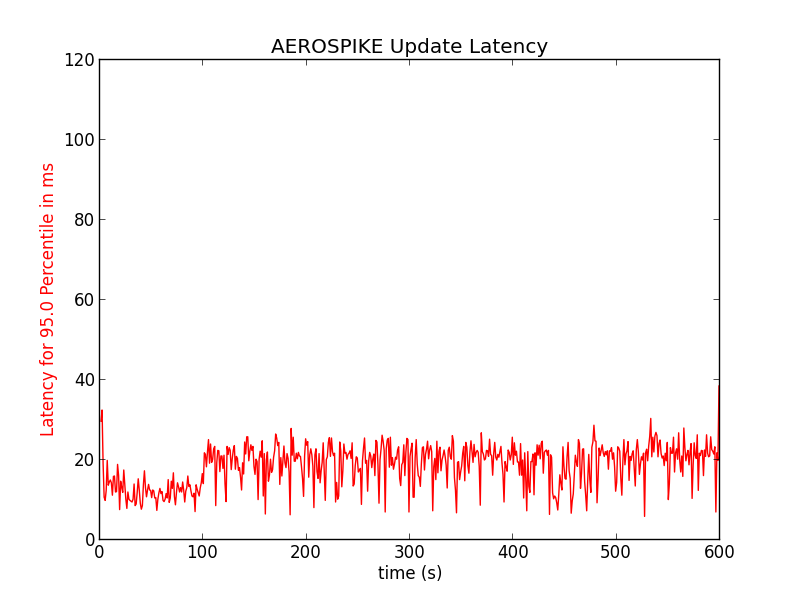
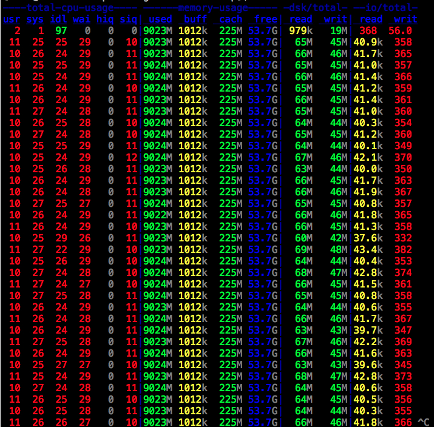
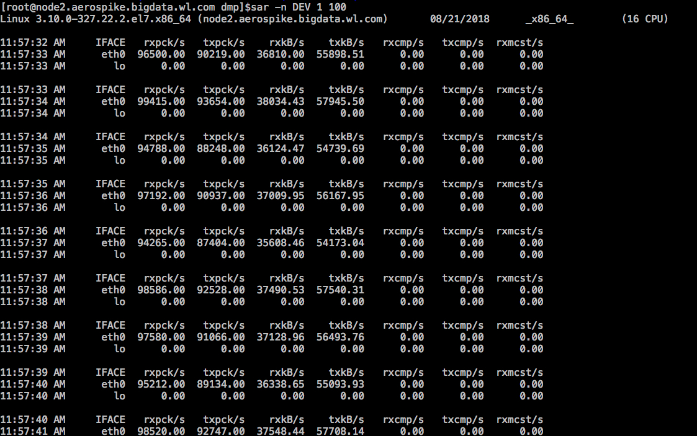

# Aerospike调研

+ 作者：黄骞
+ 日期： 2018-08-14

Aerospike是一个支持强一致性高性能的key-value存储数据库。aerospike的存储是无格式化化的，99%的基于主键get性能在1ms以内。主要应用在广告、数据实时分析、风控等业务领域。支持UDF（基于lua）。

## 一、数据模型

aerospike包含`namespace`、`set`、`record`、`bin`等几个核心概念。关于概念，我们可以类比`MySQL`数据库。

| MySQL | Aerospike |
|------|-------|
| `Database` | `namespace` |
| `Table`  | `Set`  |
| `Row` | `Record` |
| `Cloumn` | `Bin`  |

+ `namespace`

    aerospike的社区版本支持2个`namespace`，企业版本支持32个。在aerospike中，可以针对每个`namespace`配置存储方案，比如存储引擎，默认TTL等等。

    

+ `Set`

    `Set`是一个`namespace`下面某一特定类型的记录的集合。

    

+ `Record`


    Aerospike是一个行存储数据库，记录是存储的基本单元。记录可以属于`namespace`或者`set`。记录使用key作为唯一标志符。一个记录包含以下信息

 |组件 | 描述 |
 |-----|-----|
 | `key` | 记录的唯一标识 |
 | 元数据 | 记录的版本信息、TTL、latt-update-time|
 | Bin集合  | Bin是record最小存储单元 |

+ `Bin`

    在记录中，数据存储在一个或者多个Bin中。每个Bin包含`name`和`value`。`value`的可以存储以下数据类型 integer、string、bytes、double、list、map、GeoJSON、语言的序列化Blob。

    注意，在一个namepsace中，bin的name数量不能超过32k。

##二、架构

### 2.1 aerospike的架构


aerospike架构包含了3个层次

 + client层：aserospike客户端层主要实现了服务协议和API，直接与集群通信，跟踪节点并了解数据的存储位置。通过TCP上线了搞笑的连接。可以检测集群中节点的故障的事件，并且重新路由到具有数据的副本节点上。

 + Distrubution层： Aerospikeshare-nothing架构，目标是自动故障转移。复制和交叉数据中心同步考考的存储数TB的数据。节点的跟踪是通过Paxos算法，aerospike通过心跳（主动和被动）来监控节点的连接。在distribution层有事物处理模块，主要解决同步/异步复制、代理、重复冲突解决方案。

 + 数据存储层： Aerospike是一个无模式的存储模型。但是其是按照行存储，数据会被压缩存储。用于可以基于bin建立二级索引，一个二级索引只能针对一个Bin，并且在查询和聚合的时候，每次只能使用一个二级索引。关于数据存储更多内容，请参考接下来的存储架构。

 ### 2.2 存储架构


 
 为了解决数据热点问题，aerospike引入了Digests这一层，通过对key的哈希，使得数据均匀分布。在每一个`namespace`中，数据被分布到4096个parition上。

 在aerospke中，采用的是混合式存储，内存+SSD的方案。通常来说内存和SSD的比例是1；4。我们也可以指定存储引擎为内存。对于主键和二级索引，这些数据必须存储在内存中。因此，这也会调来一个弊端，对于社区版本，重启集群时，需要重建索引，因此会比较慢。

 
 ##三、二级索引

 ### 3.1 二级索引存储方案

 二级索引采用的是哈希表和B数的混合式存储方案，如下图所示

   

二级索引在结构上是B树的B树的哈希。每个逻辑二级索引都有32个物理树。索引的管理由SMD负责。具体流程如下图：

  

### 3.2二级索引在何时使用？

在分布式查询中，如果用指定了使用索引，将会触发索引的查询。分布式查询的流程如下:


需要注意的是，通过API查询，每次只能指定一个过滤器，对于一次查询只能使用一个二级索引。如果需要多个过滤器，可以通过udf实现stream udf即可。

## 四、如何使用

### 4.1 官方资料

aerospike提供了丰富的API、比如Java、python、c、node、c++等等。[Java API 请参考](https://www.aerospike.com/docs/client/java/index.html)

给一个demo
```
AerospikeClient client = new AerospikeClient("192.168.1.150", 3000);

Key key = new Key("test", "demo", "putgetkey");
Bin bin1 = new Bin("bin1", "value1");
Bin bin2 = new Bin("bin2", "value2");

// Write a record
client.put(null, key, bin1, bin2);

// Read a record
Record record = client.get(null, key);

client.close();
```

这个看上去和HBase差不多。更多的例子，请参考[aerospike-java-example](https://github.com/aerospike/aerospike-client-java/blob/master/examples/README.md)


### 4.2 调研的demo

Java code

```
@RunWith(BlockJUnit4ClassRunner.class)
public class AerospikePutGetExample {

    private static final String AS_HOST = "192.168.30.216";

    private static final String NAMESPACE = "test";
    private static final String SET_NAME = "ads";

    private AerospikeClient asclient;

    @Before
    public void init(){
        asclient = new AerospikeClient(AS_HOST, 3000);
    }

    @Test
    public void testPut(){


        for(int i = 0; i < 20000; i++) {
            Key key = new Key(NAMESPACE, SET_NAME, i);
            Bin titleBin = new Bin("title", "惊喜不断，下载微鲤看看" + i);
            Bin idBin = new Bin("id", i);
            Bin urlBin = new Bin("url", "https://www.baidu.com" + i);
            Bin descBin = new Bin("desc", "欢迎下载微鲤看看，阅读挣钱");
            List<String> cityList = new ArrayList<String>();
            if(i < 100) {
                cityList.add("北京");
            }
            if(i > 50 && i < 1000) {
                cityList.add("长沙");
            }
            cityList.add("深圳");
            cityList.add("广州");
            cityList.add("上海");
            cityList.add("杭州");
            cityList.add("南京");
            Bin city = new Bin("city", cityList);
            int increment = i % 30;
            Bin age = new Bin("age", 20 + increment);

            List<String> professionalList = new ArrayList<String>();
            if(i < 200) {
                professionalList.add("互联网");
            }
            professionalList.add("医疗");
            professionalList.add("母婴");
            professionalList.add("食品");
            professionalList.add("汽车");
            Bin professional = new Bin("professional", professionalList);
            Bin startTimeBin = new Bin("start_time_ms", System.currentTimeMillis());
            Bin endTimeBin = new Bin("end_time_ms", System.currentTimeMillis() + 100000000);

            this.asclient.put(null, key, titleBin, idBin, urlBin, descBin, startTimeBin, endTimeBin, city, age, professional);
        }

    }

    @Test
    public void register(){
        RegisterTask task = this.asclient.register(null, "udf/filter_example.lua", "filter_example.lua", Language.LUA);
        task.waitTillComplete();
    }

    @Test
    public void testQuery(){
        Statement stmt = new Statement();
        stmt.setNamespace(NAMESPACE);
        stmt.setSetName(SET_NAME);
        stmt.setBinNames("id", "title", "url", "desc", "city", "professional", "age");
//        stmt.setFilter(Filter.contains("city", IndexCollectionType.LIST, "北京"));
//        stmt.setFilter(Filter.contains("professional", IndexCollectionType.LIST, "互联网"));
        stmt.setFilter(Filter.range("age", IndexCollectionType.DEFAULT, 18, 30));
//        stmt.setFilter(Filter.range("start_time_ms", IndexCollectionType.DEFAULT, System.currentTimeMillis() - 10000000, System.currentTimeMillis() + 100000000));
//        stmt.setFilter(Filter.range("end_time_ms", IndexCollectionType.DEFAULT, System.currentTimeMillis(), System.currentTimeMillis() + 100000000));


       stmt.setAggregateFunction("filter_example", "filter_match", Value.get(System.currentTimeMillis()), Value.get("北京"), Value.get("互联网"));

        QueryPolicy policy = new QueryPolicy();

        ResultSet rs = asclient.queryAggregate(policy, stmt);

        try {
            int count = 0;
            while(rs.next()){
                Map<String, Object> map = (Map<String, Object>)rs.getObject();
                System.out.println("id=" + map.get("id") + ", age=" + map.get("age") + ", title=" + map.get("title") +", url=" + map.get("url")
                + ", city=" + map.get("city") +", professional=" + map.get("professional"));
                count++;
            }
            System.out.println("count.size=" + count);
        } finally {
            rs.close();

        }

    }


    @Test
    public void test(){
        System.out.println(System.currentTimeMillis());
    }


    @Test
    public void testGet(){

        Key key = new Key(NAMESPACE, SET_NAME, 1);
        Record record =this.asclient.get(null, key);
        System.out.println("id=" + record.getInt("id"));
        System.out.println("title=" + record.getString("title"));
        System.out.println("desc=" + record.getString("desc"));
        System.out.println("url=" + record.getString("url"));
        System.out.println("start_time_ms=" + record.getLong("start_time_ms"));
        System.out.println("end_time_ms=" + record.getLong("end_time_ms"));
    }

}
```

Lua code

```
local function contains(lst, item)
    for v in list.iterator(lst) do
        if v == item then return true
        end
    end
    return false
end

local function transformToMap(record)
    local result = map()
    result['id'] = record['id']
    result['title'] = record['title']
    result['url'] = record['url']
    result['age'] = record['age']
    result['city'] = record['city']
    result['professional'] = record['professional']
    return result
end

function filter_match(stream, time, city, professional)
    local function filter_time_city_professional(record)
        if record['start_time_ms'] <= time and record['end_time_ms'] >= time and contains(record['city'], city) and contains(record['professional'], professional) then
            return true
        else
            return false

        end
    end
    return stream : filter(filter_time_city_professional) : map(transformToMap)
end
```

## 五、安装与运维

### 5.1 安装

[centos安装请参考](https://www.aerospike.com/docs/operations/install/linux/el6)

### 5.2 配置

[配置参考](https://www.aerospike.com/docs/operations/configure/index.html)

### 5.3 工具

[工具参考](https://www.aerospike.com/docs/tools/index.html)

## 六、适用场景

### 6.1 aerospike官方给出的使用场景：

 1. 广告RTB日志： 只要是数据量大，要求50ms内相应，吞吐量达、具备容错性能，需要实时决策。
 2. 金融交易记录。在电子支付、欺诈检测需要一个基于规则的引擎，需要根据交易历史来是否批准。
 3. 电信交易数据
 4. 实时数据分析

### 6.2 aerospike在微鲤适用的场景

 aerospike的存储模型和HBase非常相似。因此，所有适合HBase的地方都适合。你可以认为aerospike是一个支持OLTP的HBase。在我们公司将主要应用在以下几个方向：

 1. 数据服务化的统计结果存储。对于数据服务化平台，需要为在线业务提供RPC，需要再极端的时间响应，并且保证高可用。存储的数据是无固定格式。aerospike将承担数据服务化的数据热数据存储部分，大概是180天，用HBase来做备份，180天以后的数据HBase存储。
 2. 广告系统的统计数据存储。实时统计和离线统计存储，方便广告主和销售实时查看数据。
 3. 用户画像。aerospike是key-value格式存储，响应性能非常高，而且是无固定格式，这个非常适合画像这种稀疏列的存储。
 4. 对于实时性能要求比较高的交易数据。比如用户的金币流水记录，可以基于时间构建二级索引，快速查询流水记录。

## 七、性能优化

### 7.1 如何提高客户端的连接数和处理速度

| 参数 | 默认值 | 说明 | 热修改 |
|-------|-------|--------|----------|
|`channel-rw-recv-threads` | 16 | 处理通过读写通过到达集群内消息的线程数。此通道用于副本写入、代理等各种集群内操作 | `asinfo -v "set-config:context=network;fabric.channel-rw-recv-threads=24"`|
|`channel-rw-fds` | 8 | 打开邻近节点读写通道的套接字线程数。 | 无|
| `transaction-threads-per-queue` | 4 |处理每个事物队列的线程数。队列的数量默认是cpu的核数，不建议改，但是可以通过修改次参数调整每个队列的处理速度，值范围是1-256 | asinfo -v "set-config:context=service;transaction-threads-per-queue=6"| 
| `migrate-threads ` | 1 | 每个节点上数据迁移的线程数量，一个线程每次只迁移一个分区。取值范围0-100 | asinfo -v "set-config:context=service;migrate-threads=2"| 
| `migrate-max-num-incoming ` | 4 | 节点在一个时间点接受迁入最大的分区数 | asinfo -v "set-config:context=service;migrate-max-num-incoming=8| 
| `query-in-transaction-thread ` | false | 在事务线程中运行查询而不是使用查询线程。当您希望查询在短时间内运行或命名空间在内存中时，将其设置为“true”。如果您期望更长时间运行查询或命名空间使用磁盘存储，请将其设置为“false”。 | asinfo -v "set-config:context=service;query-in-transaction-thread=true"| 
| `query-threads` | 6 | 节点上的专用查询线程数。取值范围1-32 | asinfo -v "set-config:context=service;query-threads=12"| 
| `query-worker-threads` | 15 | 节点上的专用I/O线程数 | asinfo -v "set-config:context=service;query-worker-threads=20"| 
| `query-batch-size` | 100 | 根据IO请求执行磁盘IO的量 | asinfo -v "set-config:context=service;query-batch-size=75"| 
| `transaction-duplicate-threads` | 0 | 解决事物冲突的线程数量 | 无| 
| `batch-threads` | 4 | 批处理直接工作线程数量，取值范围0-256 | | 
| `batch-index-threads` | cpu的核数 | 批处理索引响应工作线程数，取值1-256 | asinfo -v "set-config:context=service;batch-index-threads=16"|
| `scan-threads` | 4 | 扫描的线程池大小。取值范围1-128 |asinfo -v "set-config:context=service;scan-threads=8"| 
| `service-threads` | cpu核数 | 在网络接口上接收客户端请求的线程数。取值范围1-256 || 
| `sindex-builder-threads` | 4 | 构建二级索引的线程数量 || 

### 7.2 遇到QPS瓶颈如何解决

aerospike的架构是share-nothing，应对高吞吐量瓶颈的时候，可以通过直接增加节点数量的方式解决。但是aerospike节点增加的时候每次只能一个一个的加，加入的节点必须等到数据平衡完成之后，才能加第二个节点，可能有点慢。这也是其缺点之一吧。

### 7.3 如何量化性能或者判定慢查询

aerospike提供了工具，可以查询日志延迟工具，能够统计一个时间段内的处理速度的分布直方图。具体可以参考文档[aerospike-loglatency](https://www.aerospike.com/docs/tools/asloglatency/index.html)

## 八、性能量化

aerospike官方提供了YCSB的测试脚本。这里使用了2亿条数据进行测试，每条数据1000byte（10个100byte的bin）测试。下面是测试脚本

### 8.1 测试

1. 加载数据

```
nohup bin/ycsb load aerospike -s -threads 200 -P workloads/workload-asload -p as.host=node1.aerospike.bigdata.wl.com > run.out 2> run.err &
```

2. 跑测试。 运行600秒

```
nohup bin/ycsb run aerospike -s -threads 275 -P workloads/workload-asrun -p as.host=node1.aerospike.bigdata.wl.com -p target=120000 -p maxexecutiontime=600 > run.out 2> run.err &
```

### 8.2 Block_size=1M的读写同时进行的测试

```
dd if=/dev/zero of=/dev/vdb3 bs=1M &
dd if=/dev/zero of=/dev/vdb2 bs=1M &
```

1. 读吞吐量


2. 读延迟分布


3. 读操作的对数尺度延迟分布


4. 95.%的读延迟随着时间的变化。


5. 写操作的吞吐量


6. 写操作延迟分布


7. 写操作的对数尺度的延迟分布


8. 95.%更新操作的延迟



### 8.3 测试说明

本次测试，使用了block_size=128K测试的性能差不多。对于资源的监控如下。

1. cpu没有充分使用，只打满了6个核。

```
top
```


2. 内存利用没有上去，也不是瓶颈。主要原因是测试数据尚未建立索引，建立索引之后内存使用可能增加，具体看索引的数据量。但是对于单盘的400G的SSD的话，64G内存足够。

```
free -g
```


3. 磁盘IO还有潜力挖掘，根据UCloud的官方文档，大致能够到达500MB/s，目前峰值不到70M/s，写入请求大概570次/s。因此还可以挖掘

```
dstat -cmdr
```



4. 网络带宽是瓶颈，测试样本集是2亿条数据，每条数据1000byte，由于aerospike在接受请求的同时还会做复制。基本是写请求，aerospike也会将副本数据发送到其他节点。经过network监控，网卡已经打满了（125M/s）

```
sar -n DEV 1 100
```

网络带宽测试指标说明

| 指标 | 说明 |
|-----|-----|
|rxpck/s | 每秒接受的包的数量|
|txpck/s | 每秒发出的包的数量 |
|rxKB/s | 每秒接受的数据量，单位是KB|
|txKB/s | 每秒发送的数据量，单位是KB|



结论： 在千兆网（125M/s byte）情况下，测试读写同时的最大OPS为 11W/s， 实时中打8折，大概9W/s。如果需要提升性能，需要提升网络带宽。