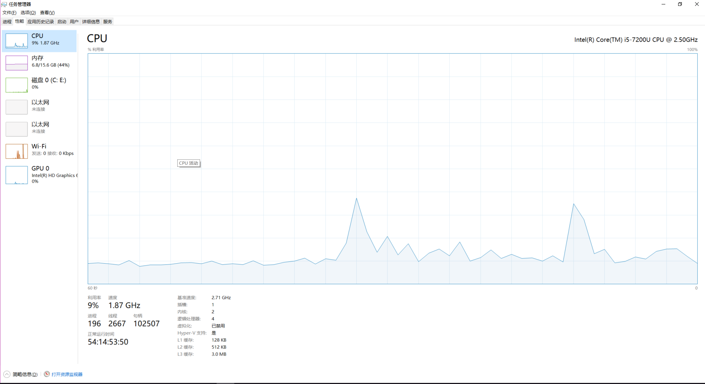

## Quasar调研 

Quasar是一个库，它为Java和[**Kotlin**](http://kotlinlang.org/)提供高性能轻量级线程，类似Go的channel，类似Erlang的actor和其他异步编程工具。

官网：http://docs.paralleluniverse.co/quasar/
  

###  一.核心概念

1. Fiber：纤程,更轻量级的线程，类似Go语言的goroutine,在任务切换时给CPU带来的负担要小得多,主要保存栈的信息
2. FiberSchedule: 纤程调度器，负责Executor的调度
3. SuspendExecution: 暂停异常，JVM线程中断的条件只有两个，一个是抛异常，另外一个就是return。Quasar就是通过抛异常的方式来达到的，然后交给调度器来处理
4. Strand: 获取线程的纤程的状态与信息，比如名字，优先级，中断，睡眠，纤程的运行状态等
5. FiberAsync:异步回调纤程
6. @Suspendable：应用于无法抛出SuspendExecution异常的方法
7. FiberUtil:Fiber工具类，可以提供运行Fiber的方法，比如FiberUtil.runFiber()
8. Channel：通道是用于在Fiber之间传递消息的队列，类似于GO的Channel,具体看使用方法

- 原理：
   
   Quasar里的Fiber其实是一个continuation，他可以被Quasar定义的scheduler调度，一个continuation记录着运行实例的状态，而且会被随时中断，并且也会随后在他被中断的地方恢复。
   Quasar其实是通过修改bytecode来达到这个目的，所以运行Quasar程序的时候，你需要先通过java-agent在运行时修改你的代码。Quasar则默认使用[**ForkJoinPool**](https://segmentfault.com/a/1190000008140126)，具有work-stealing功能的线程池来当调度器。
   work-stealing非常重要，因为你不清楚哪个Fiber会先执行完，而work-stealing可以动态的从其他的等等队列偷一个context过来，这样可以最大化使用CPU资源。
   
   - java-agent如何修改代码
   
     - 1.在运行时，监控方法抛出SuspendExecution异常，在抛出SuspendExecution异常时，Fiber会记录当时的栈的信息，停止当前纤程的运行，好让Quasar的调度器执行调度。
   
     - 2.对于接口，无法抛出SuspendExecution异常的方法，可在方法上加注解@Suspendable让java-agent来进行监控


###  二.使用

#### 2.1 借助java5提供的Instrumentation机制做代理

 - -javaagent:path-to-quasar-jar.jar  如：-javaagent:E:\workspace\idea\incubator\quasar-core-0.7.9.jar
 
 - Instrumentation介绍:[**Instrumentation**](https://www.ibm.com/developerworks/cn/java/j-lo-jse61/index.html)
 
 - jvm层级看待javaagent:[**javaagent**](http://www.infoq.com/cn/articles/javaagent-illustrated)
 
#### 2.2 使用方法
 
- **创建一个纤程**

```
new Fiber<String>(){
            @Override
            protected String run() throws SuspendExecution, InterruptedException {
                System.out.println("say Hello.");
                return "say Hello";
            }
}.start();

```

 - **利用纤程模拟生产者消费者模式**
 
```java
        Channel<Integer> natures = Channels.newChannel(-1);
        Channel<Integer> squares = Channels.newChannel(-1);

        //Producer
        new Fiber<>(() -> {
            for (int i = 0; i < 10; i++) {

                natures.send(i);
            }
            natures.close();
        }).start();


        //Consumer
        new Fiber<Void>(() -> {
            Integer v;
            while ((v = natures.receive()) != null) {
                squares.send(v * v);
            }
            squares.close();
        }).start();
``` 

### 三.优点

 - 在高吞吐量情况下，有巨大优势
 
 - 比线程更轻量级，Fiber大约占用400Byte，单机可以创建百万级Fiber

### 四.使用场景

 - 1.Fiber并不意味着它可以在所有的场景中都可以替换Thread。当fiber的代码经常会被等待其它fiber阻塞的时候，就应该使用fiber。对于那些需要CPU长时间计算的代码，很少遇到阻塞的时候，就应该首选thread
 
 ```
   Fibers are not meant to replace threads in all circumstances. A fiber should be used when its body (the code it executes) blocks very often waiting on other fibers
    (e.g. waiting for messages sent by other fibers on a channel, or waiting for the value of a dataflow-variable). For long-running computations that rarely block,
   traditional threads are preferable. Fortunately, as we shall see, fibers and threads interoperate very well.
 ```  
   
  
 - 2.对于方法上标注有synchronized关键字，不能使用Fiber
 
    - Unable to instrument com/learn/quasar/Program$Commands#myMarkedSyncMethod()V because of synchronized method

 - 3.不能用于有Thread.sleep()的方法,可以使用Strand.sleep()来代替
 
    - Unable to instrument com/learn/quasar/Program$Commands#myMarkedThreadBlockingMethod()V because of blocking call to java/lang/Thread#sleep(J)V

### 五.性能

 - Quasar性能测试
 
 **测试程序**: 单机启动200万的Fiber
 

   ```java
   
     public static void main(String[] args) throws InterruptedException {
        int FiberNumber = 2_000_000;
        CountDownLatch latch = new CountDownLatch(1);
        AtomicInteger counter = new AtomicInteger(0);

        for (int i = 0; i < FiberNumber; i++) {
            new Fiber(() -> {
                System.out.println(counter);
                counter.incrementAndGet();
                if (counter.get() == FiberNumber) {
                    System.out.println("done");
                }
                Strand.sleep(1000000);
            }).start();
        }
        latch.await();
     }
     
   ```


 - 性能图示
 
  
  
  
  
  
- Thread性能测试
 
 **测试程序** : 单机启动10万的Thread
 

 
 
   ```java

      int threadNum = 1_000_00;

      public static void main(String[] args) throws InterruptedException {
        for (int i = 0; i < threadNum; i++) {
            new Thread(() -> {
                try {
                    Thread.sleep(10000);
                } catch (InterruptedException e) {
                    e.printStackTrace();
                }
            }).start();
        }
        Thread.sleep(10000000);
     }
    
```
 
  
  - 性能图示
 
  
  
  

### 六.说明

 - 1.调试，测试环境可以打开-Dco.paralleluniverse.fibers.verifyInstrumentation=true，查看调式信息，生成环境不需要
 
 